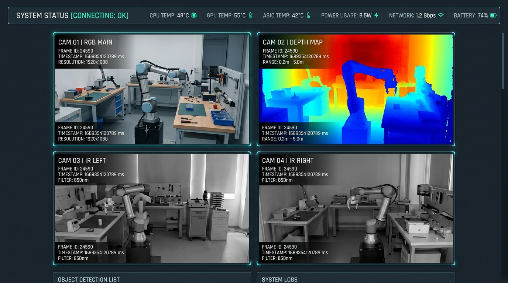
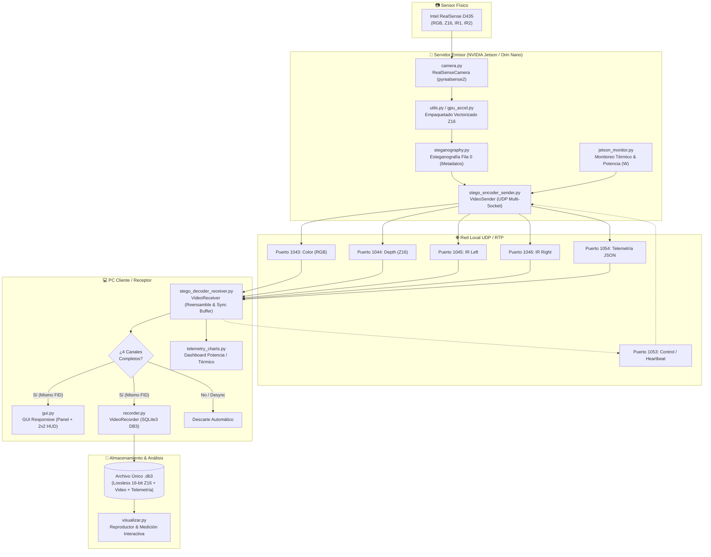
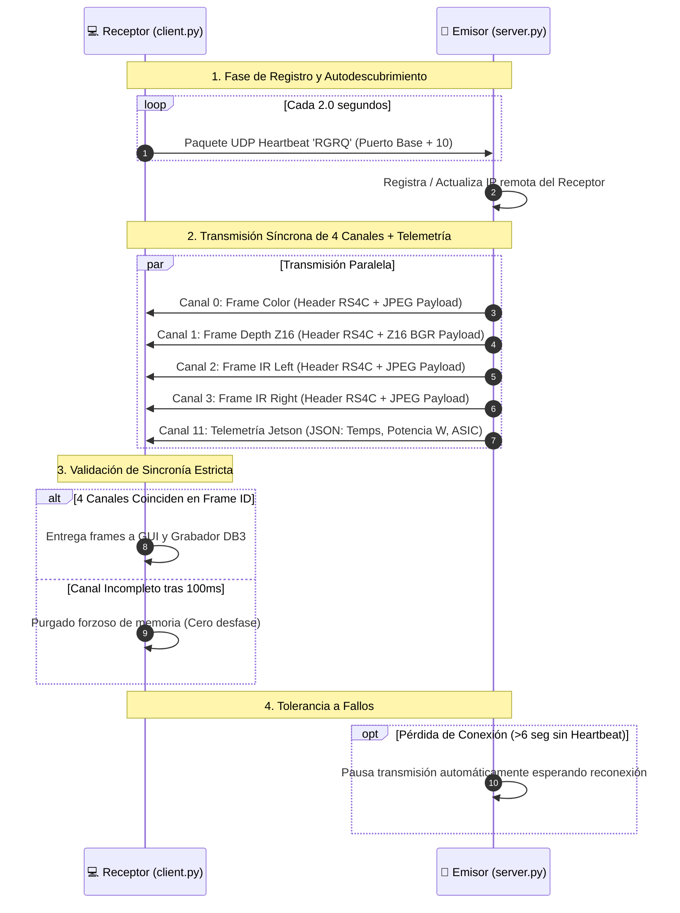
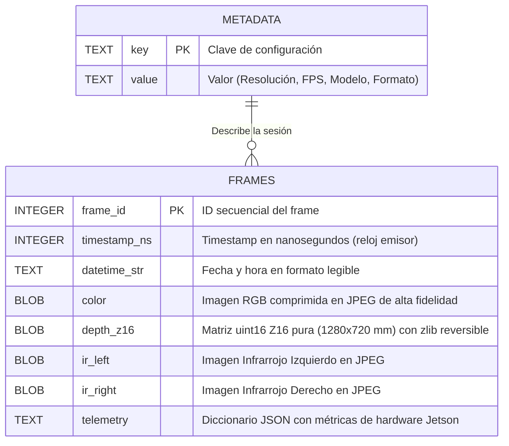
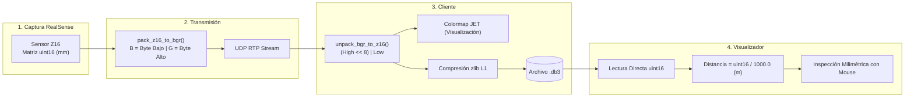
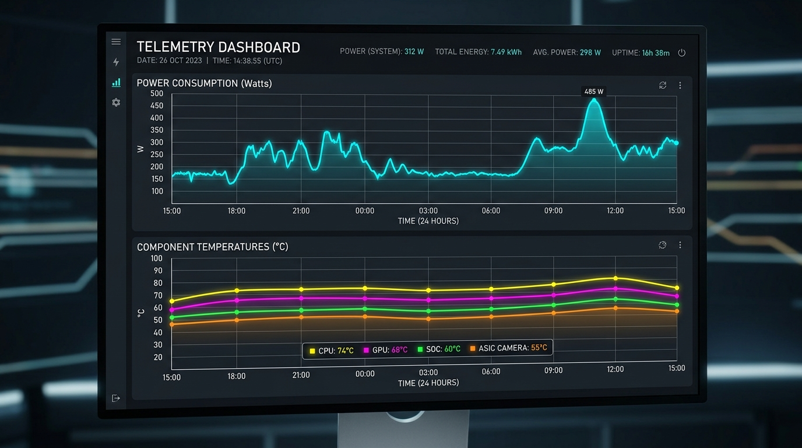

# 🎥 Transmisión Multicanal RTP/UDP & Grabación DB3 — Intel RealSense D435

Sistema modular Emisor-Receptor de alto rendimiento para la captura, transmisión síncrona por red UDP/RTP, visualización en tiempo real y **grabación multicanal autónoma en base de datos SQLite3 (`.db3`)** con **preservación 100% sin pérdidas del canal de profundidad en 16 bits (`uint16` / Z16)**, optimizado para **NVIDIA Jetson (Orin Nano, Xavier, TX2, Nano)** y PC con Ubuntu Linux / Windows.

---

## 📸 Vista General del Sistema



---

## 📌 Características Principales

- **Captura Multicanal HD (1280×720 @ 30 FPS)**:
  1. 🔴 **Color (RGB / BGR8)**: Video a color de alta definición.
  2. 🔵 **Profundidad (Depth Z16)**: Matriz nativa `uint16` con precisión milimétrica pura.
  3. ⚪ **Infrarrojo Izquierdo (IR Left Y8)**: Sensor infrarrojo 1.
  4. ⚪ **Infrarrojo Derecho (IR Right Y8)**: Sensor infrarrojo 2 con emisor láser estructurado activo.
- **Registro y Autodescubrimiento Dinámico**: El receptor se registra automáticamente con el emisor mediante *heartbeats* UDP (`RGRQ`). El servidor no requiere conocer la IP del cliente previamente.
- **Telemetría Jetson en Tiempo Real**: Monitoreo continuo de temperaturas de hardware (CPU, GPU, SOC, Board), sensor ASIC de la cámara, consumo de energía en Vatios (W), fecha y hora.
- **Grabación 100% Lossless en Base de Datos Única (`.db3`)**:
  - Almacena todos los canales individuales, telemetría y timestamps en un único archivo SQLite3 (`.db3`) estructurado.
  - Guarda la profundidad en su formato nativo de 16 bits sin pérdidas por compresión de video.
  - Organización automática por carpetas y prefijos de etiquetas (`./grabaciones/<etiqueta>/<etiqueta>_<timestamp>.db3`).
- **Dashboard Interactivo de Telemetría y Potencia**: Ventana flotante con gráficos de líneas de 24 horas para consumo eléctrico y curvas térmicas.
- **Reproductor y Analizador de Medición (`visualizar.py`)**: Inspección interactiva de distancias en metros y milímetros al pasar el mouse o fijar pines, con modos *Separado 2x2* y *Superpuesto (Alpha Blending)*.
- **Aceleración por GPU Transparente**: Soporte automático para OpenCV CUDA (`cv2.cuda`) y CuPy (`cupy`) con fallback silencioso a CPU.

---

## 🏗️ Arquitectura del Sistema y Flujo de Datos



---

## 📡 Protocolo de Comunicación y Sincronización



---

## 🗄️ Estructura de la Base de Datos Única (`.db3`)

Cada sesión de grabación se almacena en un **único archivo SQLite3 autónomo** (`.db3`):



---

## 🔬 Flujo de Profundidad Z16 (16-bit Lossless)



---

## 📊 Dashboard de Telemetría y Consumo Energético

El sistema incluye una ventana flotante interactiva que grafica en tiempo real las curvas de consumo en Vatios y temperaturas del hardware durante 24 horas:



---

## 📁 Estructura del Proyecto

```
.
├── camera.py                    # Interfaz pyrealsense2 con la Intel RealSense D435
├── config.py                    # Parámetros de red, protocolo, resolución y grabación (.db3)
├── steganography.py             # Esteganografía binaria en píxeles (fila 0) para metadatos
├── utils.py                     # Utilidades de timestamps y empaquetado de profundidad
├── jetson_monitor.py            # Monitoreo de temperaturas (CPU, GPU, SOC, Board) y potencia (W)
├── stego_encoder_sender.py     # Transmisión UDP (registro dinámico, esteganografía, compresión)
├── server.py                    # Programa principal del Servidor (Jetson / PC con cámara)
├── stego_decoder_receiver.py   # Recepción UDP (heartbeats, ensamble de fragmentos, sincronización)
├── recorder.py                  # Grabador asíncrono en base de datos SQLite3 (.db3)
├── gui.py                       # Interfaz visual responsive (panel superior + mosaico 2x2)
├── client.py                    # Programa principal del Cliente (PC remoto)
├── visualizar.py                # Reproductor y analizador interactivo de grabaciones .db3 / .mkv
├── telemetry_history.py         # Gestión y retención de historial de telemetría (30 días)
├── telemetry_charts.py          # Renderizador de gráficos de líneas de 24h para el Dashboard
├── gpu_accel.py                 # Aceleración GPU unificada (OpenCV CUDA / CuPy)
├── docs/images/                 # Diagramas y capturas visuales del sistema
├── requirements.txt             # Dependencias de Python
└── README.md                    # Documentación del proyecto
```

---

## ⚙️ Requisitos e Instalación

### 1. Dependencias del Sistema (Ubuntu Linux / Jetson)

```bash
sudo apt update
sudo apt install -y python3-pip python3-tk libgl1-mesa-glx libglib2.0-0
```

### 2. Dependencias de Python

```bash
pip install -r requirements.txt
```

> **Nota**: `pyrealsense2` debe estar instalado en el equipo **Servidor** (Jetson o PC) que tiene conectada la cámara Intel RealSense D435 por puerto USB 3.0.

---

## 🚀 Guía de Uso

### 1. Ejecutar en el Servidor (NVIDIA Jetson / PC con cámara)

Conecta la Intel RealSense D435 e inicia el servidor. **No requiere conocer la IP del cliente**:

```bash
python3 server.py
```

*Opcional: cambiar el puerto base UDP (por defecto es 1043):*
```bash
python3 server.py --port 1043
```

---

### 2. Ejecutar en el Cliente (PC Remoto)

Inicia el cliente especificando la IP de la Jetson:

```bash
python3 client.py --ip 192.168.1.XX
```

---

### 3. Controles de Teclado (Ventana del Receptor)

| Tecla | Acción |
| :---: | --- |
| **`R`** | **Iniciar grabación** en archivo `.db3` temporal. |
| **`E`** | **Detener grabación** y abrir diálogo para ingresar la **etiqueta** (`C`, `IA`, `II`, `IR`, `ensayo1`). |
| **`D`** | Mostrar / ocultar **Dashboard de Telemetría y Potencia**. |
| **`S`** | Guardar captura de pantalla en PNG del Dashboard. |
| **`A`** | Navegar fechas anteriores en el Dashboard. |
| **`Q`** / **`ESC`** | Salir y cerrar la aplicación limpiamente. |

---

## 🔍 Reproducción e Inspección de Grabaciones (`visualizar.py`)

Para reproducir y analizar grabaciones `.db3` (con precisión milimétrica pura) o `.mkv`:

```bash
python3 visualizar.py
# o pasando la ruta del archivo directamente:
python3 visualizar.py ./grabaciones/ensayo1/ensayo1_20260824_203000.db3
```

### Controles del Reproductor:
- **`[P]` / `[Espacio]`**: Pausar / Reanudar video.
- **`[M]`**: Alternar entre **Modo Separado (2x2)** y **Modo Superpuesto (Alpha Blending)**.
- **`[1] / [2]`**: Regular transparencia del canal de Profundidad en modo superpuesto.
- **`[3] / [4]`**: Regular transparencia del canal Infrarrojo en modo superpuesto.
- **`[<-] / [->]`**: Retroceder / Avanzar 1 segundo.
- **`[Cursor Mouse]`**: Muestra la distancia exacta en metros y milímetros en tiempo real.
- **`[Clic Izquierdo]`**: Fijar un punto de medición permanente.
- **`[Clic Derecho]`**: Limpiar marcas de medición.
- **`[Q] / [ESC]`**: Salir.

---

## 📂 Organización de Salida de Grabaciones

Las grabaciones se almacenan automáticamente bajo la estructura:

```text
grabaciones/
├── C/
│   └── C_20260824_153000.db3
├── IA/
│   └── IA_20260824_161500.db3
├── II/
│   └── II_20260824_170000.db3
└── IR/
    └── IR_20260824_174500.db3
```
