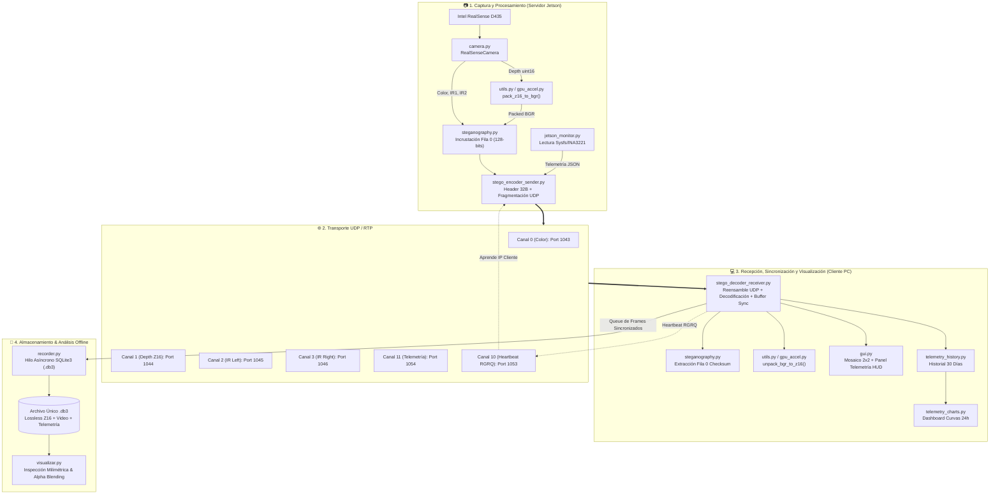
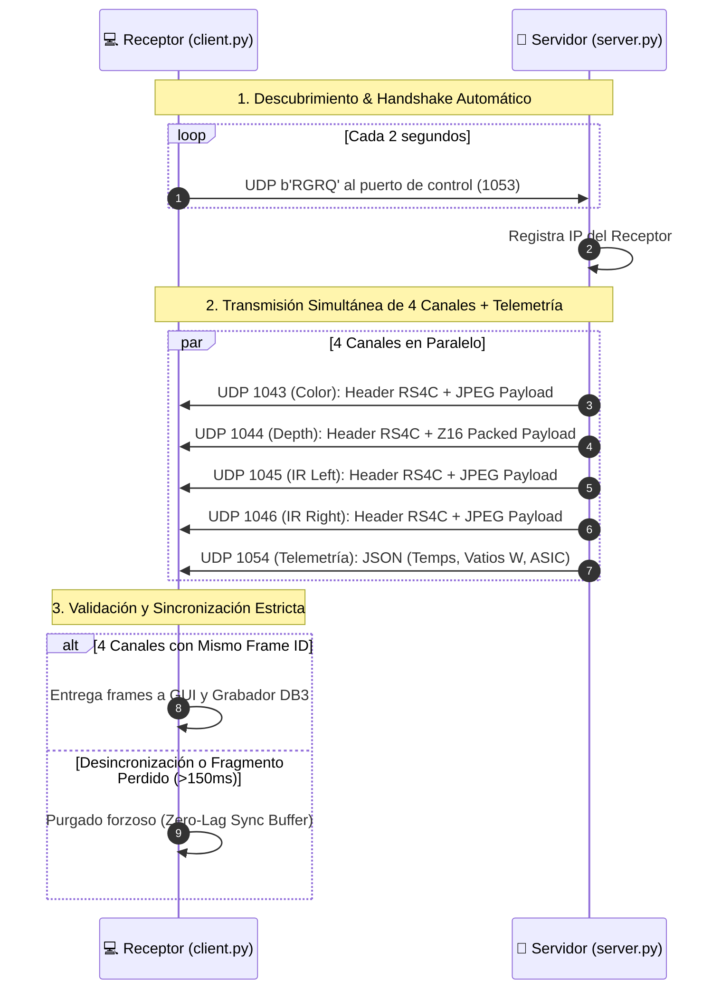
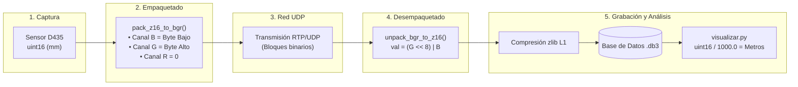
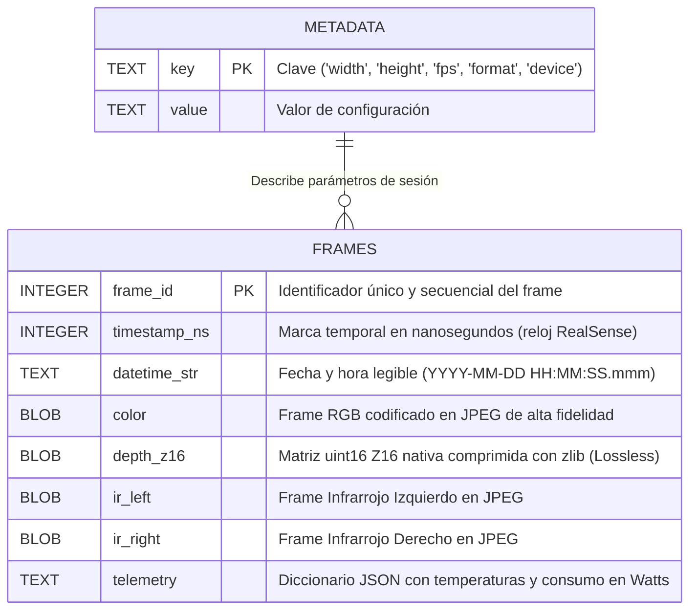
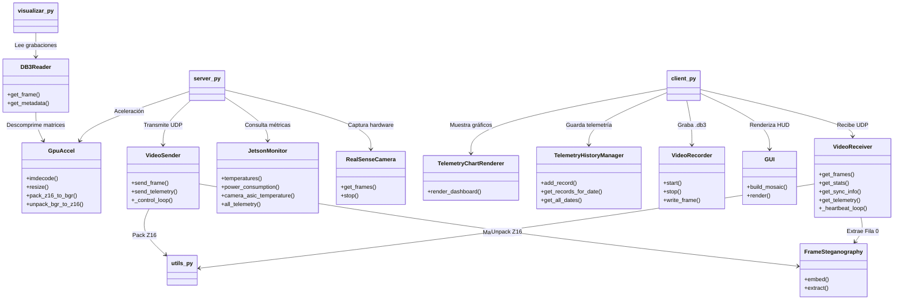

# 🎥 Transmisión Multicanal RTP/UDP & Grabación DB3 — Intel RealSense D435

Sistema modular Emisor-Receptor de alto rendimiento para la captura, transmisión síncrona por red UDP/RTP, visualización en tiempo real y **grabación multicanal autónoma en base de datos SQLite3 (`.db3`)** con **preservación 100% sin pérdidas del canal de profundidad en 16 bits (`uint16` / Z16)**, optimizado para **NVIDIA Jetson (Orin Nano, Xavier, TX2, Nano)** y PC con Ubuntu Linux / Windows.

---

## 📸 Vista Previa del Sistema

| Interfaz del Receptor (Mosaico 2x2 + Telemetría HUD) | Dashboard de Consumo Energético y Curvas Térmicas (24h) |
| :---: | :---: |
|  |  |

---

## ⚡ Guía Rápida de Arranque (Quick Start)

> [!TIP]
> **Autodescubrimiento Dinámico**: El servidor no requiere conocer la IP del receptor. El receptor envía *heartbeats* y el servidor detecta su IP automáticamente.

### 1. Requisitos e Instalación

#### A. Dependencias del Sistema Operativo (Ubuntu Linux / NVIDIA Jetson)
```bash
sudo apt update
sudo apt install -y python3-pip python3-tk libgl1-mesa-glx libglib2.0-0
```

#### B. Dependencias de Python
```bash
pip install -r requirements.txt
```
*(Opcional para aceleración GPU máxima)*:
```bash
pip install cupy-cuda12x   # Para CUDA 12.x / JetPack 6
# o
pip install cupy-cuda11x   # Para CUDA 11.x / JetPack 5
```

---

### 2. Ejecución Inmediata

#### Paso 1: Iniciar el Servidor (En la Jetson o PC con la RealSense conectada)
```bash
python3 server.py
```
*Opcional con puerto personalizado:*
```bash
python3 server.py --port 1043
```

#### Paso 2: Iniciar el Cliente (En el PC Receptor / Laptop)
```bash
python3 client.py --ip <IP_DE_LA_JETSON>
```
*Ejemplo:* `python3 client.py --ip 192.168.1.50`

---

### 3. Controles de Teclado del Receptor (`client.py`)

| Tecla | Acción |
| :---: | :--- |
| **`R`** | **Iniciar grabación**: Graba en `.db3` temporal sin pérdida de profundidad. |
| **`E`** | **Detener y Etiquetar**: Abre diálogo gráfico para nombrar la prueba (`C`, `IA`, `II`, `IR`, `ensayo1`) y guardarla en `./grabaciones/<etiqueta>/`. |
| **`D`** | **Dashboard de Telemetría**: Abre/cierra la ventana con gráficos de 24h de potencia (W) y temperaturas. |
| **`S`** | Guardar captura PNG del Dashboard de telemetría a disco. |
| **`A`** | Navegar a fechas anteriores en el Dashboard de telemetría. |
| **`Q` / `ESC`** | Cerrar y salir de forma limpia. |

---

### 4. Reproducción y Análisis de Grabaciones (`visualizar.py`)

Abre el reproductor interactivo con cálculo de distancias milimétricas en tiempo real:

```bash
# Selector interactivo de archivos
python3 visualizar.py

# O abriendo un archivo directo:
python3 visualizar.py ./grabaciones/C/C_20260824_153000.db3
```

#### Controles del Reproductor:
- **`[Espacio]` / `[P]`**: Pausar / Reanudar reproducción.
- **`[M]`**: Alternar entre **Modo Separado (2x2)** y **Modo Superpuesto (Alpha Blending RGB + Depth + IR)**.
- **`[1] / [2]`**: Ajustar opacidad de la capa de Profundidad.
- **`[3] / [4]`**: Ajustar opacidad de la capa Infrarroja.
- **`[<-] / [->]`**: Salto de 1 segundo atrás / adelante.
- **`[Cursor del Mouse]`**: Medición de distancia exacta en metros y milímetros en tiempo real.
- **`[Clic Izquierdo]`**: Fijar marcador/pin de medición permanente en pantalla.
- **`[Clic Derecho]`**: Limpiar pines de medición.

---

## 🏗️ ¿Cómo Funciona el Programa? (Arquitectura Interna)

El sistema opera bajo un modelo desacoplado y orientado al rendimiento en tiempo real, compuesto por **4 subsistemas principales**:



---

## 📡 Protocolos de Comunicación y Sincronización

### 1. Handshake y Autodescubrimiento UDP
1. El **Receptor** envía cada 2 segundos un datagrama UDP de 4 bytes (`b'RGRQ'`) al puerto de control del servidor (`port_base + 10`).
2. El **Servidor** lee el remitente del socket y registra la dirección IP remota. Si transcurren más de 6 segundos sin paquetes de control, el servidor pausa el envío para ahorrar CPU/red.



### 2. Estructura del Header Binario UDP (`RS4C`)
Cada datagrama UDP enviado lleva un encabezado binario de **32 bytes** estructurado como:
`>4sIQBBBBI8s`

| Offset (Bytes) | Campo | Tipo | Descripción |
| :---: | :---: | :---: | :--- |
| `0 - 3` | `magic` | `char[4]` | Firma binaria fija `b'RS4C'`. |
| `4 - 7` | `frame_id` | `uint32` | Número secuencial del frame. |
| `8 - 15` | `timestamp_ns` | `uint64` | Timestamp en nanosegundos del sensor. |
| `16` | `channel` | `uint8` | Identificador del canal (`0`=Color, `1`=Depth, `2`=IR1, `3`=IR2). |
| `17` | `frag_idx` | `uint8` | Índice del fragmento actual (0-indexed). |
| `18` | `frag_total` | `uint8` | Total de fragmentos en los que se dividió el frame. |
| `19` | `reserved` | `uint8` | Reservado para alineación de memoria. |
| `20 - 23` | `data_len` | `uint32` | Longitud en bytes del payload del fragmento. |
| `24 - 31` | `reserved2` | `char[8]` | Espacio reservado para extensiones futuras. |

---

## 🔬 Flujo de Profundidad Z16 (16-bit Lossless)

Las imágenes de profundidad de la RealSense D435 entregan distancias en **16 bits enteros (`uint16`)** con escala de 1 mm por valor (0 a 65535 mm). Para transmitirlas y almacenarlas sin degradación:



---

## 🗄️ Estructura de la Base de Datos Única (`.db3`)

El sistema almacena las sesiones de grabación en un archivo SQLite3 autónomo con formato `.db3`, asegurando portabilidad e integridad relacional:



---

## 📂 Desglose de Módulos `.py`, Funciones y Relaciones

El proyecto está organizado en 15 módulos especializados. A continuación se detalla qué hace cada archivo `.py`, sus funciones/clases clave y cómo interactúan entre sí:

### Diagrama de Relaciones entre Módulos



---

### Descripción Detallada por Archivo

#### 1. [`camera.py`](camera.py) — Interfaz de Captura con Intel RealSense
- **Propósito**: Conecta con la cámara Intel RealSense D435 mediante la librería oficial `pyrealsense2`, configurando los streams simultáneos de 4 canales a 1280×720 @ 30 FPS.
- **Clase Principal**: `RealSenseCamera`
- **Métodos**:
  - `__init__(record_bag_path)`: Configura los 4 streams (`color` BGR8, `depth` Z16, `infrared` 1 Y8, `infrared` 2 Y8) y enciende el proyector láser infrarrojo (`rs.option.emitter_enabled`).
  - `get_frames()`: Bloquea hasta obtener el lote sincronizado de frames (`wait_for_frames()`).
  - `stop()`: Detiene la pipeline de captura de la cámara.

---

#### 2. [`config.py`](config.py) — Configuración Central del Sistema
- **Propósito**: Centraliza todas las constantes del protocolo de red, puertos, parámetros de la cámara, opciones de compresión y parámetros de grabación.
- **Constantes Clave**:
  - `UDP_PORT_BASE = 1043`: Puerto base UDP.
  - `PACKET_MAGIC = b'RS4C'`: Firma de paquetes de datos.
  - `REGISTER_MAGIC = b'RGRQ'`: Firma de paquetes de heartbeat.
  - `CAMERA_WIDTH = 1280`, `CAMERA_HEIGHT = 720`, `CAMERA_FPS = 30`: Resolución y framerate.
  - `JPEG_QUALITY = 88`: Balance entre calidad y ancho de banda.
  - `PANEL_HEIGHT = 120`: Altura del panel superior de telemetría.

---

#### 3. [`jetson_monitor.py`](jetson_monitor.py) — Monitoreo de Hardware Jetson
- **Propósito**: Lee sensores térmicos y de potencia en placas NVIDIA Jetson (Nano, TX2, Xavier, Orin) y PC Linux/Windows.
- **Clase Principal**: `JetsonMonitor`
- **Métodos**:
  - `temperatures()`: Lee zonas térmicas desde `/sys/class/thermal/` y `/sys/class/hwmon/` (CPU, GPU, SOC, Board).
  - `power_consumption()`: Lee los rieles del sensor de corriente INA3221 (`/sys/bus/i2c/drivers/ina3221x/`) entregando la potencia en Vatios (W).
  - `camera_asic_temperature()`: Consulta la temperatura interna del ASIC de la RealSense.
  - `all_telemetry()`: Agrupa todas las métricas en un diccionario estructurado con fecha y hora.

---

#### 4. [`gpu_accel.py`](gpu_accel.py) — Aceleración GPU Unificada
- **Propósito**: Detecta automáticamente disponibilidad de **OpenCV CUDA** (`cv2.cuda`) y **CuPy** (`cupy`) para acelerar decodificación y álgebra de matrices, aplicando *fallback* transparente a CPU/NumPy.
- **Clase Principal**: `GpuAccel` (instancia singleton `GPU`).
- **Métodos**:
  - `imdecode(buf)`: Decodifica buffers JPEG en GPU o CPU.
  - `resize(img, size)`: Redimensiona imágenes usando interpolación acelerada.
  - `pack_z16_to_bgr(depth_z16)` / `unpack_bgr_to_z16(bgr_packed)`: Conversión vectorizada de profundidad de 16 bits sin pérdida.
  - `summary()`: Reporta el estado de los aceleradores de hardware.

---

#### 5. [`utils.py`](utils.py) — Utilidades Compartidas
- **Propósito**: Provee funciones auxiliares para formateo de tiempo y operaciones matemáticas de profundidad.
- **Funciones**:
  - `formatear_timestamp_ns(timestamp_ns)`: Convierte marcas temporales de nanosegundos en strings legibles `HH:MM:SS.mmm`.
  - `pack_z16_to_bgr(depth_z16)`: Delega en `gpu_accel.GPU` para empaquetar `uint16` en BGR `uint8`.
  - `unpack_bgr_to_z16(bgr_packed)`: Delega en `gpu_accel.GPU` para recuperar la matriz original `uint16`.
  - `get_gpu_backend()`: Retorna `"cupy"` o `"numpy"`.

---

#### 6. [`steganography.py`](steganography.py) — Esteganografía Binaria en Fila 0
- **Propósito**: Incrusta metadatos binarios de sincronización (`frame_id`, `timestamp_ns`, `channel_id`, `checksum`) en las primeras filas de cada frame mediante bloques de píxeles (2×2), permitiendo sincronización a prueba de pérdidas de red.
- **Clase Principal**: `FrameSteganography`
- **Métodos**:
  - `embed(frame, frame_id, timestamp_ns, channel_id)`: Codifica 16 bytes (128 bits) con checksum en los píxeles superiores izquierdos.
  - `extract(frame)`: Lee los bloques de píxeles, reconstruye los 128 bits y valida el checksum.

---

#### 7. [`stego_encoder_sender.py`](stego_encoder_sender.py) — Transmisor UDP y Registro Dinámico
- **Propósito**: Gestiona los sockets UDP de transmisión, escucha peticiones de registro de clientes en segundo plano, comprime imágenes, ensambla el header `RS4C` y fragmenta los datagramas.
- **Clase Principal**: `VideoSender`
- **Métodos**:
  - `_control_loop()`: Hilo daemon que escucha datagramas `RGRQ` para aprender la IP del receptor.
  - `send_frame(channel_id, frame, frame_id, timestamp_ns)`: Comprime en JPEG, aplica esteganografía, divide en fragmentos `< 60,000 bytes` y transmite.
  - `send_telemetry(telemetry_dict)`: Envía el JSON de telemetría por el canal 11.

---

#### 8. [`server.py`](server.py) — Orquestador del Servidor
- **Propósito**: Punto de entrada principal en la Jetson. Conecta la cámara `RealSenseCamera`, inicializa `VideoSender` y `JetsonMonitor`, y ejecuta el bucle de captura y transmisión a 30 FPS.
- **Flujo de Ejecución**:
  1. Parsea argumentos de línea de comandos (`--port`, `--record-bag`).
  2. Inicializa hardware y aceleradores GPU.
  3. Bucle continuo: Captura frames $\rightarrow$ Empaqueta Z16 $\rightarrow$ Lee telemetría $\rightarrow$ Transmite vía UDP.

---

#### 9. [`stego_decoder_receiver.py`](stego_decoder_receiver.py) — Receptor UDP y Búfer de Sincronización
- **Propósito**: Escucha en 4 puertos UDP de video + 1 de telemetría, envía heartbeats periódicos, reensambla fragmentos y mantiene un búfer de sincronización temporal estricto.
- **Clase Principal**: `VideoReceiver`
- **Métodos**:
  - `start()` / `stop()`: Inicia y detiene hilos de escucha por canal y el hilo de heartbeat.
  - `_receive_channel_loop(ch_id)`: Reensambla fragmentos UDP y decodifica JPEG/BGR.
  - `_sync_buffer`: Búfer que empareja frames de los 4 canales con el mismo `frame_id`.
  - `get_frames()`: Retorna la tupla `(color, depth, ir_left, ir_right)` sincronizada.
  - `get_telemetry()`: Retorna el último diccionario de telemetría recibido.

---

#### 10. [`recorder.py`](recorder.py) — Grabador Asíncrono SQLite3 (`.db3`)
- **Propósito**: Escribe las sesiones de grabación en archivos SQLite3 (`.db3`) en un hilo desacoplado mediante una cola (`Queue(maxsize=120)`), garantizando que las escrituras a disco no bloqueen los 30 FPS.
- **Clase Principal**: `VideoRecorder`
- **Métodos**:
  - `start(base_dir, nombre)`: Crea el archivo `.db3`, inicializa las tablas `metadata` y `frames`, y activa el modo `WAL` (*Write-Ahead Logging*).
  - `write_frame(color, depth_z16, ir_left, ir_right, telemetry, ...)`: Comprime la matriz de profundidad con `zlib` (100% lossless) y encola el registro.
  - `stop(nueva_etiqueta)`: Vacía la cola, cierra la base de datos y organiza el archivo en `./grabaciones/<etiqueta>/`.

---

#### 11. [`gui.py`](gui.py) — Interfaz Gráfica Responsive y HUD
- **Propósito**: Construye el mosaico visual compuesto por el panel superior de telemetría y la cuadrícula 2×2 (RGB, Depth, IR Left, IR Right).
- **Clase Principal**: `GUI`
- **Métodos**:
  - `_create_info_panel(...)`: Dibuja el panel superior con temperaturas de CPU, GPU, SOC, ASIC, consumo en Vatios, FPS, fecha y estado de grabación.
  - `build_mosaic(...)`: Combina los 4 canales con sus títulos y badges de estado.
  - `render(...)`: Escala el mosaico manteniendo relación de aspecto y lo presenta en la ventana OpenCV.

---

#### 12. [`client.py`](client.py) — Orquestador del Receptor
- **Propósito**: Punto de entrada principal en el PC receptor. Conecta con el servidor, instancia la GUI, el grabador `.db3`, el historial de telemetría y el dashboard de gráficos.
- **Flujo de Ejecución**:
  1. Recibe argumentos (`--ip`, `--port`).
  2. Inicia `VideoReceiver` y conecta con la Jetson.
  3. Bucle de renderizado: Obtiene frames sincronizados $\rightarrow$ Actualiza historial $\rightarrow$ Dibuja mosaico $\rightarrow$ Procesa teclas (`R`, `E`, `D`, `Q`).

---

#### 13. [`telemetry_history.py`](telemetry_history.py) — Gestor de Historial de Telemetría
- **Propósito**: Almacena en memoria y opcionalmente en disco el historial continuo de temperaturas y potencia consumida, con purga automática tras 30 días de retención.
- **Clase Principal**: `TelemetryHistoryManager`
- **Métodos**:
  - `add_record(telemetry_data)`: Agrega una nueva muestra con timestamp.
  - `get_records_for_date(date_str)`: Filtra mediciones de un día específico.
  - `get_all_dates()`: Retorna la lista de fechas disponibles con datos.

---

#### 14. [`telemetry_charts.py`](telemetry_charts.py) — Renderizador del Dashboard de Gráficas
- **Propósito**: Genera un canvas gráfico de 1600×900 píxeles con diagramas de líneas temporales de 24 horas para consumo eléctrico (W) y curvas térmicas (°C).
- **Clase Principal**: `TelemetryChartRenderer`
- **Métodos**:
  - `render_dashboard(history_manager)`: Dibuja las curvas de potencia, líneas de temperatura por sensor, estadísticas min/max/promedio y encabezado con fecha de consulta.
  - `save_to_png(canvas)`: Exporta el dashboard como imagen PNG en disco.

---

#### 15. [`visualizar.py`](visualizar.py) — Reproductor y Analizador de Grabaciones
- **Propósito**: Herramienta de post-procesamiento para reproducir y analizar grabaciones `.db3` y `.mkv`. Permite inspeccionar valores de distancia milimétrica interactiva con el mouse y combinar canales en modo *Alpha Blending*.
- **Clases Principales**: `DB3Reader`, `MKVReader`
- **Funciones**:
  - Modo 2×2 sincronizado con lectura directa de matrices `uint16`.
  - Modo Superpuesto: Fusión ponderada de canales RGB, Depth (colormap JET) e Infrarrojo.
  - Medición milimétrica interactiva y fijación de pines de distancia.

---

## 📂 Organización del Directorio de Grabaciones

Las grabaciones se estructuran automáticamente por carpetas basadas en la etiqueta asignada al detener (`E`):

```text
grabaciones/
├── C/                               # Calibraciones / Control
│   ├── C_20260824_153000.db3
│   └── C_20260824_182000.db3
├── IA/                              # Infección / Anomalía Tipo A
│   └── IA_20260824_161500.db3
├── II/                              # Infección / Anomalía Tipo B
│   └── II_20260824_170000.db3
├── IR/                              # Infrarrojo de Referencia
│   └── IR_20260824_174500.db3
└── ensayo1/                         # Ensayos personalizados
    └── ensayo1_20260824_203000.db3
```
